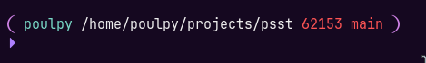
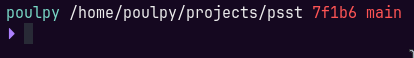
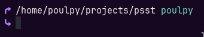
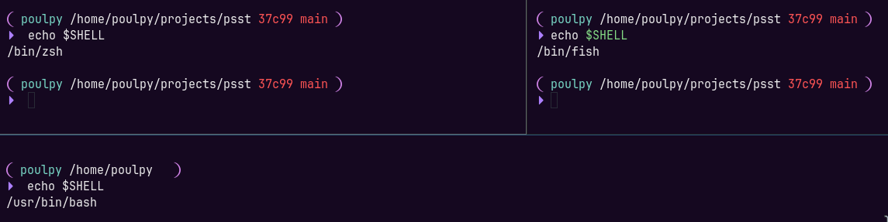

<div align="center">
  <h1>psst</h1>
  <p>A tiny, fast, cross-shell prompt written in C++.</p>
  <p>
    <a href="#examples">Examples</a> ·
    <a href="#performance">Fast startup</a> ·
    <a href="#customize-the-prompt">Source-level customization</a> ·
    <a href="#install">Bash · Zsh · Fish</a>
  </p>
</div>

<br>

**psst** is a small, cross-shell prompt generator written in C++.

The project follows a deliberately simple model inspired by suckless software:

- Prompt layout is ordinary C++ in `src/commands/init.cpp`.
- Each prompt component is a small `IWidget` implementation.
- Shell adapters turn the rendered widgets into Bash, Zsh, or Fish prompt output.
- There is no configuration language, daemon, plugin manager, or runtime dependency.

## Examples










## Why psst?

Most prompt frameworks are heavy and (arguably) slow. psst optimizes for a short execution time and source-level customization.

That makes psst a good fit if you want:

- One prompt definition shared across shells.
- Git, path, user, battery, and time widgets without shell scripts in the hot path.
- A prompt whose behavior you can control.

## Performance

On an older ThinkPad with an AMD PRO A12, psst feels almost instant. The prompt is usually ready before the next command is typed, while heavier prompts can visibly pause after every command. That difference is especially noticeable when changing directories, switching Git branches, or running many short commands.

The default configuration measured about **2.1 ms per prompt render** locally:

```text
mean: 2.1 ms ± 0.5 ms
range (min .. max): 1.6 ms .. 8.7 ms
runs: 346
```

psst stays fast because it is a small native executable with a fixed C++ widget list. It does not launch a collection of shell helpers or parse a large runtime configuration for every redraw. Actual results depend on hardware, filesystem state, repository size, and enabled widgets, so this is a baseline rather than a universal guarantee.

The benchmark scripts are in `bench/`:

```sh
cd bench
./run-all.sh
```

## Install

### Build

Requirements:

- A C++20 compiler
- GNU Make
- `ccache` is optional; the Makefile uses it when available. It is recommended if you wish to contribute, since it makes rebuilding much easier

```sh
git clone https://github.com/poulpy/psst.git
cd psst
make
```

```sh
make install
```

This installs `prompter` in `~/.local/bin` and adds the shell integration to your Bash, Zsh, or Fish configuration when it is not already present. Use `make move` for the same setup while removing the local build from the repository.

### Shell integration

If you prefer to configure the shell manually, evaluate the generated shell assignment when the prompt is drawn:

```sh
PROMPTER="$HOME/.local/bin/prompter"

if [ -n "$BASH_VERSION" ]; then
    PROMPT_COMMAND='status_code=$?; eval "$("$PROMPTER" init "$status_code")"'
elif [ -n "$ZSH_VERSION" ]; then
    precmd() { local status_code=$?; eval "$("$PROMPTER" init "$status_code")"; }
fi
```

For Fish, add this to `~/.config/fish/config.fish`:

```fish
function fish_prompt
    set -l status_code $status
    $HOME/.local/bin/prompter init $status_code | source
end
```

The command must be able to identify the current shell through `$SHELL`. Run `prompter --help` to see the available command and exit codes.

## Customize The Prompt

This is the central psst workflow.

1. Open `src/commands/init.cpp`.
2. Edit `default_config()`.
3. Put widgets and separators in the order you want them rendered.
4. Rebuild with `make`.
5. Run `./prompter init` to inspect the generated prompt code.

The vector returned by `default_config()` is the complete prompt definition. For example:

```cpp
std::vector<std::shared_ptr<IWidget>> default_config() {
    return {
        std::make_unique<Cyan>(),
        std::make_unique<User>(),
        std::make_unique<Reset>(),
        std::make_unique<Separator>("@"),
        std::make_unique<Path>(),
        std::make_unique<Separator>(" "),
        std::make_unique<GitBranch>(),
        std::make_unique<Separator>("\n> ")
    };
}
```

The order matters. Every widget is rendered from left to right and concatenated into one prompt.

`PythonVenv`, `NodeVersion`, `ExitStatus`, `Hostname`, and `SSHSession` are available but are not enabled in the default prompt. Add them explicitly when you want them:

```cpp
std::make_unique<PythonVenv>(),
std::make_unique<Separator>(" "),
std::make_unique<NodeVersion>(),
std::make_unique<Separator>(" "),
std::make_unique<SSHSession>(),
```

### Built-in widgets

| Widget | Output |
| --- | --- |
| `User` | Current user name |
| `Path` | Current working directory |
| `ShortPath` | Shortened working directory |
| `PythonVenv` | Active Python virtual environment name, when `VIRTUAL_ENV` is set |
| `NodeVersion` | Active Node.js version from `NODE_VERSION` |
| `ExitStatus` | Previous command status, when non-zero |
| `Hostname` | Current host name from `HOSTNAME` |
| `SSHSession` | Prints `ssh` when `SSH_CONNECTION` is set |
| `Git` | Current commit hash, limited by `Git(max_chars)` |
| `GitBranch` | Current branch |
| `Battery` | Battery percentage/status |
| `Charging` | Prints a custom indicator while the battery is charging |
| `Bat` | Battery information variant |
| `Hours` | Current hour |
| `Minute` | Current minute |
| `Seconds` | Current seconds |
| `RootSymbol` | Root-user marker |
| `Separator("...")` | Literal text, whitespace, or a line break |

Color and style widgets are state changes in the output, not visible text:

`Blue`, `Bold`, `Cyan`, `Green`, `Pink`, `Purple`, `Red`, `Yellow`, and `Reset`.

### Separators and conditional output

`Separator` accepts a string and an optional flag controlling whether it is printed when the preceding stateful widget has no output:

```cpp
std::make_unique<Separator>(" ")       // normal separator
std::make_unique<Separator>("\n> ")    // newline and prompt character
std::make_unique<Separator>(" on ", 0)  // always print this separator
```

The default configuration uses this behavior to avoid dangling separators around optional Git and battery information. The second argument is useful for decorative text that must always appear.

`Charging` works similarly, but only prints its custom text when the battery is charging:

```cpp
std::make_unique<Battery>(),
std::make_unique<Separator>(" "),
std::make_unique<Charging>("[AC]"),
```

### Add a custom widget

Widgets implement one small interface:

```cpp
class IWidget {
public:
    virtual ~IWidget() = default;
    virtual std::string render() = 0;
};
```

Create a header and source file under `src/widgets/`:

```cpp
// src/widgets/Status.hpp
#pragma once
#include "widgets/IWidget.hpp"

class Status : public IWidget {
public:
    std::string render() override;
};
```

```cpp
// src/widgets/Status.cpp
#include "widgets/Status.hpp"

std::string Status::render() {
    return " ready";
}
```


Keep widgets cheap. They execute every time the shell redraws the prompt. Prefer direct file reads and system calls over launching subprocesses.

## Contributing

The smallest useful contribution is usually a widget:

1. Implement `IWidget::render()` in `src/widgets/`.
2. Add the source file to `Makefile`.
3. Build with `make` and test from both a repository and a non-repository directory.
4. If it affects prompt latency, run the benchmark harness and include the environment details.

Please keep the hot path dependency-light and document behavior that depends on platform files such as `/sys/class/power_supply`.

Run the built-in widget checks with:

```sh
make test
```
